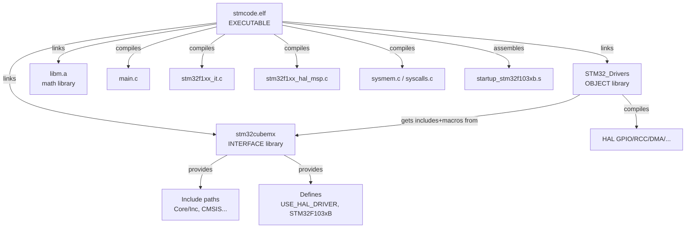

## ✅ 任务清单

- [x] 理解 CMake 构建系统的核心概念
- [x] 掌握 CMakeLists.txt 的结构与语法
- [x] 看懂 STM32 项目的 CMake 构建配置
- [x] 学会工具链文件 (toolchain) 的编写
- [x] 理解 CMakePresets.json 的作用
- [x] 能独立为嵌入式项目编写 CMakeLists.txt

---

## 1. CMake 是什么？

> [!note] 一句话理解
> CMake 是一个**构建系统生成器**。它不是直接编译代码，而是生成其他构建系统（如 Makefile、Ninja）的配置文件。

```
你写 CMakeLists.txt  →  CMake 处理  →  生成 Makefile/Ninja.build  →  make/ninja 编译
```

---

## 2. CMake 三要素：Target、Property、Command

### 2.1 Target（目标）

Target 是 CMake 的核心抽象。三种主要类型：

| Target 类型 | 对应产物 | 命令 |
|-------------|---------|------|
| **EXECUTABLE** | `.elf` / `.exe` | `add_executable(name ...)` |
| **STATIC** | `.a` / `.lib` | `add_library(name STATIC ...)` |
| **INTERFACE** | 无产物，只传递属性 | `add_library(name INTERFACE)` |

### 2.2 两个关键 Target 子类型

> [!warning] OBJECT 库 vs STATIC 库 — 嵌入式开发必知
>
> ```cmake
> # OBJECT 库：编译成 .o 但不打包 .a
> # .o 文件直接参与最终链接，--gc-sections 有效
> add_library(foo OBJECT src1.c src2.c)
>
> # STATIC 库：打包成 .a
> # 链接时可能整个 .a 被拉入，浪费空间
> add_library(foo STATIC src1.c src2.c)
> ```
>
> **嵌入式优先用 OBJECT 库** ✅

### 2.3 属性的传递方向

```cmake
# PRIVATE   - 仅自己用
# INTERFACE - 仅传递给依赖者
# PUBLIC    - 自己用 + 传递给依赖者

target_include_directories(foo PRIVATE inc/)    # 只有 foo 能用
target_compile_definitions(foo INTERFACE DEBUG)  # 只有依赖 foo 的能用
target_link_libraries(foo PUBLIC math)           # foo 和依赖者都能用
```

---

## 3. 一个完整的 CMakeLists.txt 模板

### 3.1 最小嵌入式项目结构

```
project/
├── CMakeLists.txt          ← 根文件
├── CMakePresets.json        ← 预设（可选）
├── cmake/
│   └── toolchain.cmake      ← 交叉编译工具链
├── Core/
│   ├── Inc/
│   └── Src/
│       └── main.c
└── Drivers/
```

### 3.2 根 CMakeLists.txt（带注释）

```cmake
# ============ 1. 版本声明 ============
cmake_minimum_required(VERSION 3.22)

# ============ 2. 语言标准 ============
set(CMAKE_C_STANDARD 11)
set(CMAKE_C_STANDARD_REQUIRED ON)   # 强制要求 C11
set(CMAKE_C_EXTENSIONS ON)          # 允许 GNU 扩展（如 asm）

# ============ 3. 构建类型 ============
if(NOT CMAKE_BUILD_TYPE)
    set(CMAKE_BUILD_TYPE "Debug")
endif()

# ============ 4. 便利工具 ============
set(CMAKE_EXPORT_COMPILE_COMMANDS TRUE)  # 给 clangd/LSP 用

# ============ 5. 项目声明 ============
project(my_project)
enable_language(C ASM)

# ============ 6. 创建可执行目标 ============
add_executable(${PROJECT_NAME})

# ============ 7. 添加子目录 ============
add_subdirectory(cmake/stm32cubemx)

# ============ 8. 用户自定义区域 ============
target_sources(${PROJECT_NAME} PRIVATE
    Core/Src/my_module.c
)

target_include_directories(${PROJECT_NAME} PRIVATE
    Core/Inc
)

target_compile_definitions(${PROJECT_NAME} PRIVATE
    MY_FEATURE=1
)

# ============ 9. 链接库（必须在子目录之后） ============
target_link_libraries(${PROJECT_NAME} PRIVATE
    stm32cubemx     # INTERFACE 库: 提供头文件 + 宏
    STM32_Drivers   # OBJECT 库: 提供 HAL 实现
    m               # libm 数学库
)
```

### 3.3 子目录 CMakeLists.txt（分层模式）

```cmake
# cmake/stm32cubemx/CMakeLists.txt

# --- 定义宏（INTERFACE 库传递） ---
set(MX_DEFINES
    USE_HAL_DRIVER
    STM32F103xB
    $<$<CONFIG:Debug>:DEBUG>    # 仅在 Debug 模式下添加
)

# --- 定义头文件路径 ---
set(MX_INCLUDES
    ../../Core/Inc
    ../../Drivers/CMSIS/Include
)

# --- INTERFACE 库：仅传递编译选项，不编译代码 ---
add_library(stm32cubemx INTERFACE)
target_include_directories(stm32cubemx INTERFACE ${MX_INCLUDES})
target_compile_definitions(stm32cubemx INTERFACE ${MX_DEFINES})

# --- OBJECT 库：编译但不打包 ---
add_library(STM32_Drivers OBJECT)
target_sources(STM32_Drivers PRIVATE
    ../../Drivers/src/gpio.c
    ../../Drivers/src/rcc.c
)
target_link_libraries(STM32_Drivers PUBLIC stm32cubemx)

# --- 应用源文件直接加入主程序 ---
target_sources(${CMAKE_PROJECT_NAME} PRIVATE
    ../../Core/Src/main.c
    ../../startup.s       # 汇编启动文件
)
```

---

## 4. 工具链文件 (Toolchain File) 详解

> [!tip] 工具链文件的作用
> 告诉 CMake: **"你不是在编译给本机用，而是交叉编译给另一个平台"**

```cmake
# gcc-arm-none-eabi.cmake

# --- 核心声明：裸机 ARM ---
set(CMAKE_SYSTEM_NAME               Generic)   # 无操作系统
set(CMAKE_SYSTEM_PROCESSOR          arm)

# --- 编译器指定 ---
set(TOOLCHAIN_PREFIX                arm-none-eabi-)

set(CMAKE_C_COMPILER                ${TOOLCHAIN_PREFIX}gcc)
set(CMAKE_ASM_COMPILER              ${CMAKE_C_COMPILER})
set(CMAKE_CXX_COMPILER              ${TOOLCHAIN_PREFIX}g++)
set(CMAKE_LINKER                    ${TOOLCHAIN_PREFIX}g++)
set(CMAKE_OBJCOPY                   ${TOOLCHAIN_PREFIX}objcopy)
set(CMAKE_SIZE                      ${TOOLCHAIN_PREFIX}size)

# --- 关键：跳过编译器测试（交叉编译无法运行） ---
set(CMAKE_TRY_COMPILE_TARGET_TYPE STATIC_LIBRARY)

# --- CPU 特定参数 ---
set(TARGET_FLAGS "-mcpu=cortex-m3")
set(CMAKE_C_FLAGS "${CMAKE_C_FLAGS} ${TARGET_FLAGS} -Wall")
set(CMAKE_C_FLAGS "${CMAKE_C_FLAGS} -fdata-sections -ffunction-sections")
set(CMAKE_ASM_FLAGS "${CMAKE_C_FLAGS} -x assembler-with-cpp -MMD -MP")

# --- 按构建类型的优化级别 ---
set(CMAKE_C_FLAGS_DEBUG "-O0 -g3")
set(CMAKE_C_FLAGS_RELEASE "-Os -g0")

# --- C++ 特殊设置 ---
set(CMAKE_CXX_FLAGS "${CMAKE_C_FLAGS} -fno-rtti -fno-exceptions")

# --- 链接器设置 ---
set(CMAKE_EXE_LINKER_FLAGS "${TARGET_FLAGS}")
set(CMAKE_EXE_LINKER_FLAGS "${CMAKE_EXE_LINKER_FLAGS} -T \"${CMAKE_SOURCE_DIR}/STM32F103XX_FLASH.ld\"")
set(CMAKE_EXE_LINKER_FLAGS "${CMAKE_EXE_LINKER_FLAGS} -Wl,-Map=${CMAKE_PROJECT_NAME}.map")
set(CMAKE_EXE_LINKER_FLAGS "${CMAKE_EXE_LINKER_FLAGS} -Wl,--gc-sections")
set(CMAKE_EXE_LINKER_FLAGS "${CMAKE_EXE_LINKER_FLAGS} -Wl,--print-memory-usage")
```

### 关键参数速查表

| 参数 | 含义 | 嵌入式必加? |
|------|------|:---:|
| `-mcpu=cortex-m3` | 目标 CPU 架构 | ✅ |
| `-fdata-sections` | 每个变量独立段 | ✅ |
| `-ffunction-sections` | 每个函数独立段 | ✅ |
| `-Wl,--gc-sections` | 链接时删除未用段 | ✅ |
| `-T flash.ld` | 链接脚本 (内存布局) | ✅ |
| `-Wl,-Map=xxx.map` | 生成内存映射文件 | 推荐 |
| `-fstack-usage` | 栈使用分析 | 推荐 |
| `--specs=nano.specs` | 精简版 C 库 | 推荐 |

---

## 5. CMakePresets.json — 一键构建

```json
{
    "version": 3,
    "configurePresets": [
        {
            "name": "Debug",
            "generator": "Ninja",
            "binaryDir": "${sourceDir}/build/${presetName}",
            "toolchainFile": "${sourceDir}/cmake/gcc-arm-none-eabi.cmake",
            "cacheVariables": {
                "CMAKE_BUILD_TYPE": "Debug"
            }
        },
        {
            "name": "Release",
            "inherits": "Debug",
            "cacheVariables": {
                "CMAKE_BUILD_TYPE": "Release"
            }
        }
    ],
    "buildPresets": [
        { "name": "Debug",   "configurePreset": "Debug" },
        { "name": "Release", "configurePreset": "Release" }
    ]
}
```

### 使用方式

```bash
# 配置
cmake --preset Debug

# 编译
cmake --build build/Debug

# 一键配置 + 编译
cmake --preset Debug && cmake --build build/Debug
```

---

## 6. 本项目 STM32 的依赖关系图



---

## 7. 常见问题与排错

> [!bug] 问题1: `undefined reference to ...`
> **原因**: 忘了链接某个库或 OBJECT 库
> **修复**: `target_link_libraries(${PROJECT_NAME} PRIVATE 缺少的库)`

> [!bug] 问题2: `cannot find -lob`
> **原因**: ARM 工具链错误地声称需要 libob.a
> **修复**: `list(REMOVE_ITEM CMAKE_C_IMPLICIT_LINK_LIBRARIES ob)`

> [!bug] 问题3: 头文件找不到
> **原因**: `target_include_directories` 用了 PRIVATE 但依赖者需要
> **修复**: 改为 PUBLIC 或 INTERFACE

> [!bug] 问题4: `--gc-sections` 无效，固件体积巨大
> **原因**: 用了 STATIC 库而非 OBJECT 库
> **修复**: `add_library(foo OBJECT ...)` 替代 STATIC

---

## 8. 编写 CMakeLists.txt 的心法口诀

> [!success] TL;DR
>
> 1. **先定 Target**: EXECUTABLE 还是 LIBRARY？
> 2. **再分层次**: INTERFACE 库传头文件/宏，OBJECT 库编译驱动
> 3. **属性三件套**: sources, includes, defines —— 每个 target 各配一份
> 4. **最后链接**: `target_link_libraries` 连接依赖网
> 5. **交叉编译用 toolchain file**，不要手改编译器路径
> 6. **用 Ninja 做生成器**，比 Make 快得多

---

## 9. 参考资源

- [CMake 官方文档](https://cmake.org/documentation/)
- [GNU ARM Embedded Toolchain](https://developer.arm.com/tools-and-software/open-source-software/developer-tools/gnu-toolchain/gnu-rm)
- STM32CubeMX CMake 生成指南
- [[lsinitramfs-笔记]] — Linux initramfs 笔记
- [[pthreads-笔记]] — POSIX 线程笔记

---

*生成于: 2026-06-10 | 基于 stmcode 项目分析*
