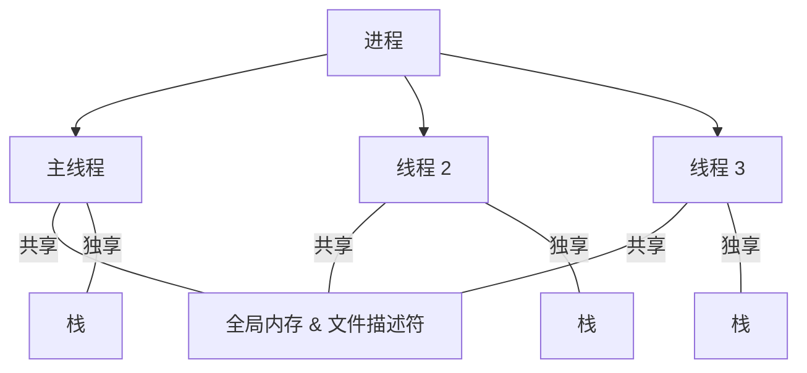

# POSIX 线程 (pthreads)

> [!abstract] 概述
> POSIX.1 定义了一套线程编程接口，通称 **Pthreads**。一个进程可包含多个线程，它们执行同一程序，共享全局内存，但各自拥有独立的栈空间。

## 共享 vs 独享

### 进程级共享

| 属性 | 相关 API |
|------|----------|
| 进程 ID / 父进程 ID | `getpid(2)` |
| 进程组 ID / 会话 ID | `getpgid(2)` |
| 用户 ID / 组 ID | `getuid(2)` |
| 打开的文件描述符 | `open(2)` |
| 文件记录锁 | `fcntl(2)` |
| 信号处置 | `sigaction(2)` |
| 文件创建掩码 | `umask(2)` |
| 当前工作目录 / 根目录 | `chdir(2)` / `chroot(2)` |
| 间隔定时器 / POSIX 定时器 | `setitimer(2)` / `timer_create(2)` |
| nice 值 | `setpriority(2)` |
| 资源限制 | `setrlimit(2)` |
| CPU 时间统计 / 资源用量 | `times(2)` / `getrusage(2)` |

### 每线程独享

| 属性 | 说明 |
|------|------|
| **栈空间** | 局部变量（自动变量） |
| **线程 ID** | `pthread_t` 类型 |
| **信号掩码** | `pthread_sigmask(3)` |
| **`errno` 变量** | 线程独立 |
| **备用信号栈** | `sigaltstack(2)` |
| **实时调度策略/优先级** | `sched(7)` |
| **CPU 亲和性** (Linux) | `sched_setaffinity(2)` |
| **Capabilities** (Linux) | `capabilities(7)` |

> [!important] 关键理解
> **共享** = 一个线程改了，其他线程都看到；**独享** = 每个线程有自己的副本，互不影响。

## 函数返回值

- **成功**: 返回 `0`
- **失败**: 返回错误码（与 `errno` 含义相同）
- ⚠️ pthreads 函数**不设置 `errno`**，错误码直接通过返回值返回
- 所有 pthreads 函数保证**不会**返回 `EINTR` 错误

## 线程 ID

`pthread_t` 类型，通过以下函数获取：

```c
pthread_t tid = pthread_self();  // 获取自己的线程 ID
```

- 线程 ID 仅在同一**进程内**保证唯一
- 线程终止并被 join 后，系统**可能复用**该 ID
- 在线程 ID 生命周期结束后使用它 → **未定义行为**

## 线程安全函数 (Thread-safe)

> [!warning] 以下函数是 POSIX 标准中**非线程安全**的
> 因为它们使用内部静态缓冲区，多线程同时调用会导致数据竞争。

| 函数 | 问题类型 |
|------|----------|
| `asctime()`, `ctime()`, `gmtime()`, `localtime()` | 时间转换 |
| `strtok()` | 字符串分割 |
| `rand()` | 随机数 |
| `getenv()`, `setenv()`, `putenv()` | 环境变量 |
| `strerror()` | 错误信息 |
| `readdir()` | 目录读取 |
| `crypt()` | 密码加密 |
| `system()` | 执行 shell 命令 |

> [!tip] 替代方案
> 使用带 `_r` 后缀的可重入版本：
> `strtok_r()`, `strerror_r()`, `readdir_r()`, `asctime_r()`, `ctime_r()` 等。

## 取消点 (Cancellation Points)

当取消类型是"延迟取消"且收到取消请求时，线程**只在调用取消点函数时**才会被取消。

### 必须的取消点（常见）

`read()`, `write()`, `open()`, `close()`, `accept()`, `connect()`, `send()`, `recv()`, `sleep()`, `nanosleep()`, `pause()`, `wait()`, `waitpid()`, `pthread_join()`, `pthread_cond_wait()`, `pthread_testcancel()`, `sem_wait()`, `poll()`, `select()`, `fcntl()` (F_SETLKW), `msgrcv()`, `msgsnd()`, `mq_receive()`, `mq_send()`

### 可能但不保证是取消点（常见）

`printf()`, `fprintf()`, `fread()`, `fwrite()`, `fopen()`, `fclose()`, `stat()`, `lstat()`, `mkdir()`, `unlink()`, `scanf()`, `getaddrinfo()`, `pthread_rwlock_rdlock()`, `pthread_rwlock_wrlock()`

> [!warning] 异步信号处理注意
> 即使不使用异步取消，在异步信号处理器中调用上述函数也可能导致数据不一致。信号应与延迟取消区域一起谨慎使用。

## Linux 上的线程实现

### LinuxThreads（旧，glibc 2.4 后废弃）

- 有"管理线程"，用信号进行内部操作
- 线程不在同一个 PID 下（`ps` 能看到每个线程）
- **不符合 POSIX 标准**：`getpid()` 在不同线程返回不同值、不共享记录锁、不共享 nice 值等

### NPTL (Native POSIX Threads Library) — 现代实现

- glibc 2.3.2 + Linux 2.6 内核起支持
- **1:1 模型**：每个线程对应一个内核调度实体
- 使用 `clone(2)` 创建线程
- 使用 `futex(2)` 实现同步原语
- 所有线程属于同一线程组，**共享同一个 PID**
- 无管理线程



## 编译方式

```bash
cc -pthread program.c -o program
```

> [!important]
> 必须使用 `-pthread`（不是 `-lpthread`），它同时设置预处理器宏和链接选项。

## 查看线程实现

```bash
getconf GNU_LIBPTHREAD_VERSION
# 输出示例: NPTL 2.38
```

## 核心 API 速览

| 功能 | 函数 |
|------|------|
| 创建线程 | `pthread_create(3)` |
| 终止线程 | `pthread_exit(3)` |
| 等待线程结束 | `pthread_join(3)` |
| 分离线程 | `pthread_detach(3)` |
| 获取自身 ID | `pthread_self(3)` |
| 比较线程 ID | `pthread_equal(3)` |
| 互斥锁 | `pthread_mutex_lock(3)` / `pthread_mutex_unlock(3)` |
| 条件变量 | `pthread_cond_wait(3)` / `pthread_cond_signal(3)` |
| 读写锁 | `pthread_rwlock_rdlock(3)` / `pthread_rwlock_wrlock(3)` |
| 线程取消 | `pthread_cancel(3)` / `pthread_setcancelstate(3)` |
| 线程局部存储 | `pthread_key_create(3)` / `pthread_setspecific(3)` |
| 一次性初始化 | `pthread_once(3)` |
| 信号掩码 | `pthread_sigmask(3)` |
| 清理处理 | `pthread_cleanup_push(3)` / `pthread_cleanup_pop(3)` |

## 基本示例

```c
#include <pthread.h>
#include <stdio.h>
#include <stdlib.h>

void *thread_func(void *arg) {
    int id = *(int *)arg;
    printf("线程 %d: ID = %lu\n", id, pthread_self());
    return NULL;
}

int main() {
    pthread_t threads[3];
    int ids[3] = {1, 2, 3};

    for (int i = 0; i < 3; i++)
        pthread_create(&threads[i], NULL, thread_func, &ids[i]);

    for (int i = 0; i < 3; i++)
        pthread_join(threads[i], NULL);  // 等待线程结束

    return 0;
}
```

## 相关笔记

- [[linuxP/并发]] — 并发编程
- [[lsinitramfs-笔记]] — Linux 内核相关
